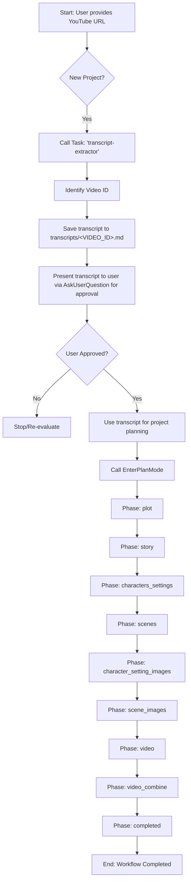

```mermaid
graph TD
    A[Start: User provides YouTube URL] --> B{New Project?};
    B -- Yes --> C[Call Task: 'transcript-extractor'];
    C --> D[Identify Video ID];
    D --> E[Save transcript to transcripts/&lt;VIDEO_ID&gt;.md];
    E --> F[Present transcript to user via AskUserQuestion for approval];
    F --> G{User Approved?};
    G -- No --> H[Stop/Re-evaluate];
    G -- Yes --> I[Use transcript for project planning];
    I --> J[Call EnterPlanMode];
    J --> K[Phase: plot];
    K --> L[Phase: story];
    L --> M[Phase: characters_settings];
    M --> N[Phase: scenes];
    N --> O[Phase: character_setting_images];
    O --> P[Phase: scene_images];
    P --> Q[Phase: video];
    Q --> R[Phase: video_combine];
    R --> S[Phase: completed];
    S --> T[End: Workflow Completed];
```