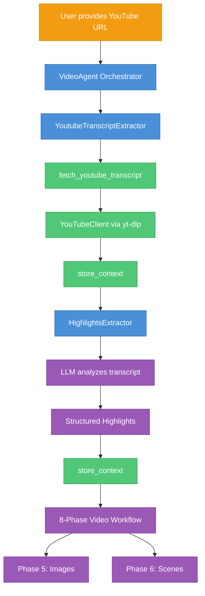

# YouTube Transcript → Highlights → Images Workflow Review

## Executive Summary

The kshana-ink codebase implements a **well-architected, modular workflow** for extracting YouTube transcripts and generating images from visual highlights. The pipeline follows a subagent pattern with clear separation of concerns. Below is a thorough analysis with findings and recommendations.

---

## 📊 Architecture Overview



---

## ✅ Strengths

### 1. **Clean Subagent Architecture**
- [YoutubeTranscriptExtractor.ts](file:///Users/bsb/work/indhic/kshana-ink/src/agents/YoutubeTranscriptExtractor.ts) - Dedicated transcript extraction agent (222 lines)
- [HighlightsExtractor.ts](file:///Users/bsb/work/indhic/kshana-ink/src/agents/HighlightsExtractor.ts) - Visual highlights extraction agent (348 lines)  
- [VideoAgent.ts](file:///Users/bsb/work/indhic/kshana-ink/src/agents/VideoAgent.ts) - Orchestrates the full pipeline (567 lines)

### 2. **Robust YouTube Client**
Located at [YouTubeClient.ts](file:///Users/bsb/work/indhic/kshana-ink/src/services/youtube/YouTubeClient.ts):
- Uses `yt-dlp` CLI for reliable extraction
- Handles multiple URL formats (youtube.com, youtu.be, embed, direct ID)
- Parses VTT subtitles with timestamp extraction
- Fallback language support
- Cleanup of temp files

### 3. **Comprehensive Prompts**
| Prompt File | Purpose | Quality |
|-------------|---------|---------|
| [transcript-extractor.md](file:///Users/bsb/work/indhic/kshana-ink/prompts/subagents/transcript-extractor.md) | Guides transcript extraction & storage | ✅ Good |
| [highlights-extractor.md](file:///Users/bsb/work/indhic/kshana-ink/prompts/subagents/highlights-extractor.md) | Visual highlight extraction with camera/lighting hints | ✅ Excellent |
| [image-generator.md](file:///Users/bsb/work/indhic/kshana-ink/prompts/subagents/image-generator.md) | Image prompt crafting guidelines | ✅ Good |

### 4. **Well-Defined Workflow Phases**
The 8-phase workflow in [types.ts](file:///Users/bsb/work/indhic/kshana-ink/src/tasks/video/workflow/types.ts) correctly handles YouTube input:
```
youtube input → skip Plot & Story phases → start at Characters/Settings
```

### 5. **Rich Highlight Structure**
The `Highlight` interface captures:
- **Visual**: moment, camera angle, composition, lighting, key elements, color palette
- **Narrative**: emotional tone, story beat, character state, thematic weight
- **Source**: timestamp range, original quote

---

## ⚠️ Gaps & Issues Found

### 1. **Missing `highlights-extractor` Subagent Definition**
> [!WARNING]
> The [agentDefinitions.ts](file:///Users/bsb/work/indhic/kshana-ink/src/agent-sdk/agentDefinitions.ts) defines 5 subagents but **does not include `highlights-extractor`**:
> - `planning`, `content`, `image`, `video`, `transcript`
> 
> However, `highlights-extractor` prompt exists and is used by `HighlightsExtractor.ts` directly.

**Impact**: Users cannot invoke highlights extraction via the `Task()` tool like other subagents.

### 2. **No Dedicated Highlights Subagent in Task Tool**
The [taskTool.ts](file:///Users/bsb/work/indhic/kshana-ink/src/core/tools/builtin/taskTool.ts#L16-L21) lists available subagents but **omits `highlights-extractor`**:
```typescript
- transcript-extractor: YouTube transcript extraction specialist...
// Missing: highlights-extractor
```

### 3. **Missing Integration Tests**
No tests found for:
- `YoutubeTranscriptExtractor` agent
- `HighlightsExtractor` agent
- End-to-end YouTube → Highlights → Images flow

The [tests/integration](file:///Users/bsb/work/indhic/kshana-ink/tests/integration) directory has tests for planning/content agents but nothing for transcript/highlights.

### 4. **Flowchart Oversimplified**
The [video_workflow_flowchart.md](file:///Users/bsb/work/indhic/kshana-ink/docs/video_workflow_flowchart.md) only mentions `transcript-extractor` but:
- Does not show the `highlights-extractor` step
- Doesn't illustrate the context passing between agents

### 5. **Error Handling Gaps**
In `YoutubeTranscriptExtractor.ts`:
- `outputFile` option is accepted but never used (line 60, 205)
- No retry logic for transient `yt-dlp` failures

### 6. **Context Passing Not Fully Documented**
The workflow relies on `$youtube_transcript` → `$highlights` context variable passing, but this isn't explicitly documented in the prompts or flowchart.

---

## 🔧 Recommendations

### High Priority

1. **Add `highlights-extractor` to Agent Definitions**
   ```typescript
   // In agentDefinitions.ts
   'highlights-extractor': {
     name: 'Highlights Agent',
     description: 'Visual highlights extraction from transcripts...',
     systemPrompt: HIGHLIGHTS_AGENT_PROMPT,
     tools: ['fetch_context', 'store_context', 'list_contexts'],
     maxIterations: 5,
   }
   ```

2. **Update Task Tool Documentation**
   Add `highlights-extractor` to the available subagent types in `taskTool.ts`.

3. **Add Integration Tests**
   Create tests for:
   - `YoutubeTranscriptExtractor.extract()` with mock LLM
   - `HighlightsExtractor.extract()` with sample transcript
   - Full pipeline YouTube URL → stored highlights

### Medium Priority

4. **Update Flowchart Documentation**
   Expand to show:
   ```mermaid
   graph TD
       A[YouTube URL] --> B[transcript-extractor]
       B --> C[Store $youtube_transcript]
       C --> D[highlights-extractor]
       D --> E[Store $highlights]
       E --> F[Characters/Settings Phase]
   ```

5. **Implement `outputFile` or Remove It**
   Either save transcript to file or remove the unused option.

6. **Add Retry Logic**
   For transient `yt-dlp` failures (network issues, rate limiting).

### Low Priority

7. **Document Context Variable Naming Convention**
   - `$youtube_transcript` - Full transcript text
   - `$highlights` - Extracted visual highlights
   - etc.

---

## 📁 Key Files Reference

| File | Purpose | Lines |
|------|---------|-------|
| [YouTubeClient.ts](file:///Users/bsb/work/indhic/kshana-ink/src/services/youtube/YouTubeClient.ts) | yt-dlp wrapper, VTT parsing | 352 |
| [tools.ts](file:///Users/bsb/work/indhic/kshana-ink/src/services/youtube/tools.ts) | `fetch_youtube_transcript` tool | 102 |
| [YoutubeTranscriptExtractor.ts](file:///Users/bsb/work/indhic/kshana-ink/src/agents/YoutubeTranscriptExtractor.ts) | Transcript agent | 222 |
| [HighlightsExtractor.ts](file:///Users/bsb/work/indhic/kshana-ink/src/agents/HighlightsExtractor.ts) | Highlights agent | 348 |
| [VideoAgent.ts](file:///Users/bsb/work/indhic/kshana-ink/src/agents/VideoAgent.ts) | Orchestrator | 567 |
| [agentDefinitions.ts](file:///Users/bsb/work/indhic/kshana-ink/src/agent-sdk/agentDefinitions.ts) | Subagent registry | 115 |
| [types.ts](file:///Users/bsb/work/indhic/kshana-ink/src/tasks/video/workflow/types.ts) | Workflow phases & types | 886 |

---

## Summary

The YouTube transcript → highlights → images workflow is **fundamentally solid** with:
- ✅ Clean subagent separation
- ✅ Robust YouTube client
- ✅ Excellent prompts with detailed visual direction
- ✅ Proper 8-phase workflow integration

Key improvements needed:
- ⚠️ Add `highlights-extractor` to agent registry & task tool
- ⚠️ Add integration tests
- ⚠️ Update documentation/flowchart

Overall: **Production-ready with minor completion work needed**.
